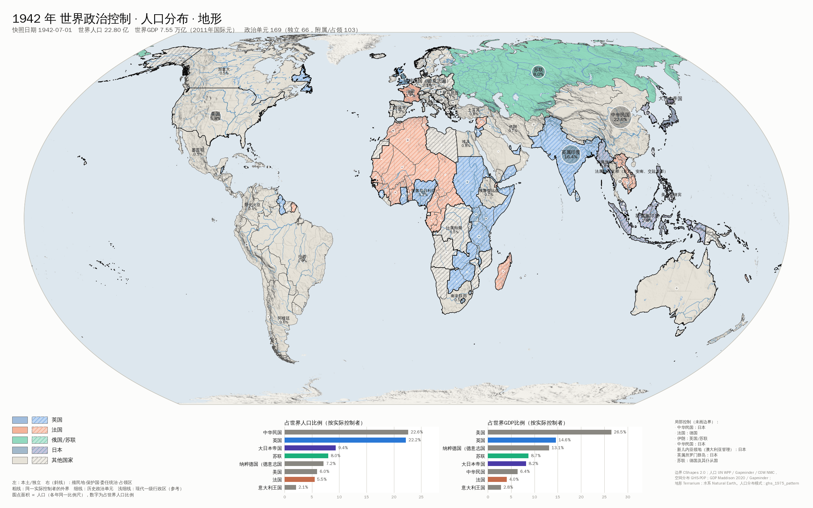

# 世界历史逐年数据库（1900–2000）

本目录是为“动态世界地图”收集整理的**逐年全球数据**，第一期覆盖 20 世纪，1900–2000 共 101 年。数据既可直接导入其他项目，也可以从原始数据重新生成。每一年的结构完全一致，内容包括：

| 内容 | 每年提供的数据 |
|---|---|
| 实际控制的政治地图 | 当年存在的全部国家和殖民地、保护国、委任统治地、占领区的边界；法理宗主与实际控制者；整块占领 / 吞并事件；局部占领说明 |
| 行政区划 | 三级结构：实际控制者（帝国 / 国家）→ 历史政治单元（独立国或各殖民地）→ 一级行政区参考块（现代省 / 州，按当年边界切分，见“局限”） |
| 人口及分布 | 各单元、各一级区块、各宗主的人口，及其占世界和占宗主的比例；0.5° 人口网格 |
| GDP | 各单元、各一级区块、各宗主的 GDP（2011 年国际元）、人均 GDP 及占世界比例；0.5° GDP 网格 |
| 地形与河流 | 高程网格、山体阴影、等高分层带、河流、湖泊（按建坝年份和历史湖面区分年份）、冰川、山脉 / 高原 / 沙漠名称、山峰 |
| 地图 | 每年一张预览地图 `maps/<年份>.png`，叠加上述全部图层 |

快照时间统一为**每年 7 月 1 日**，与联合国和 Maddison 年中人口估计的口径一致。坐标为 WGS84 经纬度（EPSG:4326）。



## 文件

```
world-history-data/
  db/world_history_1900_2000.sqlite   主数据库：全部表、几何、网格、地形
  exports/                             便于前端导入的文件
    index.json                         年份列表、文件布局、字段说明
    years/<年份>.json                  每年一份，结构一致
    geometry/units.topojson            全部历史政治单元边界（共享边，键 unit_id）
    geometry/admin1_pieces.geojson     一级行政区参考块（键 piece_id）
    grids/population_<年份>.tif        0.5° 人口网格（人 / 格）
    physical/                          高程 GeoTIFF、山体阴影 PNG、等高分层、河流、湖泊、冰川、地名
  maps/<年份>.png                      每年一张地图
  curated/control_events.csv           人工整理的实际控制事件（占领、吞并、分裂）
  curated/unit_names.csv               随年代变化的中英文名称（如 大清 → 中华民国 → 中华人民共和国）
  scripts/                             完整构建流程
  build_all.sh                         一键重建
```

## 用法示例

动态地图只需加载一次几何，切换年份时只换属性：

```js
const topo = await (await fetch('exports/geometry/units.topojson')).json();
const year = await (await fetch('exports/years/1938.json')).json();
const byId = new Map(year.units.map(u => [u.unit_id, u]));
// topojson.feature(topo, topo.objects.units).features 中只渲染 byId 里有的 unit_id
// 着色用 byId.get(id).controller.gwcode，人口比例用 pop_share_world
```

SQL：

```sql
-- 1942 年按实际控制者统计的人口、GDP 占世界比例
SELECT sovereign_name_zh, n_units, population, pop_share_world, gdp_share_world
FROM sovereign_year WHERE year = 1942 AND basis = 'de_facto' ORDER BY population DESC LIMIT 10;

-- 1930 年英属印度内部各一级区块的人口比例
SELECT p.name_zh, p.name, a.population, a.pop_share_unit
FROM admin1_year a JOIN admin1_pieces p USING (piece_id)
JOIN unit_year u ON u.year = a.year AND u.unit_id = a.unit_id
WHERE a.year = 1930 AND u.name_zh = '英属印度' ORDER BY a.population DESC;
```

几何列是 GeoJSON 文本，不需要 GIS 扩展。网格和栅格以 zlib 压缩的小端数组存储，同一行带有分辨率、西界、北界、宽、高和数据类型；第 0 行是最北一行。

## 数据库表

| 表 | 内容 |
|---|---|
| `meta`, `sources` | 版本、口径、单位；数据来源、引用与许可 |
| `years` | 每年一行：快照日期、世界人口、世界 GDP、单元数量、人口空间模式来源 |
| `units` | 历史政治单元（CShapes 记录），含起止日期、首都、面积、标注点、边界 |
| `unit_year` | **核心表**，每年每单元一行：当年中英文名、CShapes 状态、法理宗主、实际控制者、控制类型与事件、人口、GDP、人均 GDP、面积、密度、各类占比、人口校准方式 |
| `sovereign_year` | 每年每宗主一行，`basis` 区分 `de_jure`（CShapes 宗主）和 `de_facto`（实际控制） |
| `admin1_pieces`, `admin1_year` | 一级行政区参考块的几何，以及每年的人口、GDP、占所属单元和占世界的比例 |
| `country_series` | 输入数据：现代国界下的逐年人口和人均 GDP，每个值都带来源标记 |
| `admin1_targets` | 输入数据：省 / 州级人口校准目标（目前为美国各州 1900 年起的逐年数据） |
| `control_events`, `unit_names` | 人工整理表 |
| `grids` | 每年 0.5° 的人口网格（人）和 GDP 网格（千国际元） |
| `rasters` | 5′（约 9 km）高程（米）和山体阴影 PNG |
| `physical_features` | 陆地、河流、湖泊、冰川、等高分层、地理区域、海域、地物点、山峰，带 `valid_from` / `valid_to` |

## 方法

**政治地图与实际控制。** 边界、状态（独立、殖民地、保护国、委任统治、占领）和宗主来自 CShapes 2.0（1886–2019，逐日）。CShapes 只编码国际承认的变化，二战时期仍把奥地利、波兰、法国、荷兰等画成独立国。因此 `curated/control_events.csv` 补充了 69 条实际控制事件：

- 35 条整块事件。每年快照日处于事件期间时，改写该单元的实际控制者，例如：1938–1945 德国吞并奥地利；1940–1944 德国占领丹麦、挪威、荷比卢、法国（1942 年 11 月后）；1942–1945 日本占领菲律宾、荷属东印度、马来亚、缅甸；1945–1955 盟国占领奥地利；1945–1952 盟国占领日本；1979–1989 越南占领柬埔寨。
- 34 条局部事件，只作说明，不画假边界。例如：伪满洲国和日占华东、德占苏联西部、维希法国时期的占领区、国共内战、北塞浦路斯、德涅斯特河沿岸等。

**人口。** 人口分三步计算：

1. 现代国界下的逐年国家人口：1950 年起取联合国 WPP，1900–1949 取 Gapminder，并在 1950 年按比例衔接到联合国水平。
2. 把国家人口分配到 5′ 网格上，再按每年的历史边界汇总。网格空间模式 1975–2000 取 GHS-POP 各期的插值，1975 年前沿用 1975 年模式。美国另按各州逐年人口校准。
3. 历史边界与任何现代国家都对不上的独立国（德意志帝国、俄罗斯帝国、奥匈帝国、两战间的波兰、捷克斯洛伐克、波罗的海三国等），1950 年前按 Correlates of War NMC 的当时疆域人口重新缩放。COW 在二战中把吞并区也计入人口，这些年份沿用战前比例。

每个单元年的 `pop_calibration` 字段记录了实际采用的方式。

**GDP。** 每个网格的 GDP 等于人口乘以该网格所属现代国家当年的人均 GDP，再按历史边界汇总，单位为 2011 年国际元。人均 GDP 的取值顺序：

1. 有 Maddison 2020 数值时直接使用。
2. 两个 Maddison 数值之间，按 Gapminder 的年度走势插值。
3. Maddison 范围之外，按 Gapminder 的增长率链接。
4. 完全没有 Maddison 数据的国家，用 Gapminder 数值乘以当年的换算比。
5. 再没有数据的，取所在次区域的中位数。

来源标记见 `country_series.gdppc_source`。独立国另附 Fariss 等（2022）基于当时疆域的 GDP 估计，列为 `gdp_alt_fariss2022_2011usd`，供对照。

**地形与水系。** 高程取 Terrarium z5 瓦片（SRTM、GMTED2010、ETOPO1），重投影到 5′ 网格。河流、湖泊、冰川取 Natural Earth 1:10m，河流带中文名。水库按建坝年份出现，如米德湖 1936、雷宾斯克水库 1941、纳赛尔湖 1970。咸海、乍得湖、罗布泊在 1970 年前使用历史湖面。

## 数量核对

（构建完成后填写）

## 局限与后续

1. **1975 年前的省内人口分布是近似值。** 原计划使用 HYDE 历史人口网格，但这次构建所在环境的网络策略屏蔽了 HYDE 的下载地址 `geo.public.data.uu.nl`（Utrecht 大学；WRI 的 S3 镜像也拒绝访问）。所以 1975 年前，各国内部的空间分布沿用 1975 年模式（美国已按州校准）。各国家、帝国和殖民地的总人口不受此影响，受影响的是国内细分比例和网格热力图。允许该域名后运行 `./build_all.sh hyde`，流程会自动改用 HYDE 3.5 的十年一期网格并逐年插值。这条代码路径在本环境中尚未实际运行过。
2. **“行政区划”有两层。** 历史上真实的一层是 CShapes 政治单元，包括每块殖民地、保护国和委任统治地，即帝国内部的一级划分。省 / 州一层用的是 Natural Earth 现代一级行政区，按当年边界切分，作为统计参考块，不是当年的省界。目前没有公开的全球逐年历史省界数据集；中国民国省界等区域性资料可以按 `admin1_targets` 和 `admin1_pieces` 的结构逐国补充。
3. **局部占领没有边界。** 例如日占区、伪满洲国、德占苏联、维希法国分界线，只记录在 `partial_control_events` 中。整块事件的起止日期按通行史实整理，学术引用前请核对。
4. **CShapes 不单列的小属地并入邻近单元或缺失。** 例如香港、澳门、直布罗陀、多数小岛属地。
5. **地形和水系是现代数据。** 除水库和三个历史湖泊外，没有复原河道变迁，例如 1938–1947 年的黄河改道。
6. **1950 年前很多亚非国家的 GDP 是插补值。** 来源标记逐值可查。

## 来源与许可

| 数据 | 许可 |
|---|---|
| CShapes 2.0（Schvitz et al. 2022，经 CRAN `cshapes` 包分发） | **CC BY-NC-SA 4.0：非商业、相同方式共享**。由它派生的边界与单元数据随之受此约束 |
| GHS-POP R2023A（欧盟 JRC） | CC BY 4.0 |
| UN WPP、Gapminder 人口与 GDP、Maddison Project 2020（经 OWID / open-numbers） | CC BY 4.0 / CC BY 3.0 IGO |
| COW NMC v6、Fariss et al. 2022（经 R 包 `peacesciencer`） | 研究用途，须引用 |
| 美国各州人口（US Census，经 JoshData） | 公有领域 |
| Natural Earth | 公有领域 |
| Terrarium 地形瓦片 | 见 [归属说明](https://github.com/tilezen/joerd/blob/master/docs/attribution.md) |
| `curated/` 整理表与本目录代码 | CC0 |

完整引用写在数据库的 `sources` 表里。用于商业项目前，请先处理 CShapes 的非商业条款。

## 重建

```sh
pip install shapely pyproj rasterio numpy scipy pillow matplotlib pyshp pandas pyreadr
./build_all.sh          # 约 30 分钟，需下载约 2.5 GB 原始数据（raw/、work/ 不提交）
```

把 `scripts/common.py` 中的 `YEAR_START` / `YEAR_END` 改为其他年份，即可扩展到 19 世纪或 21 世纪。CShapes 覆盖 1886–2019；GHS-POP 覆盖到 2030；HYDE 可回溯到 1800 年以前。19 世纪需要 HYDE。
